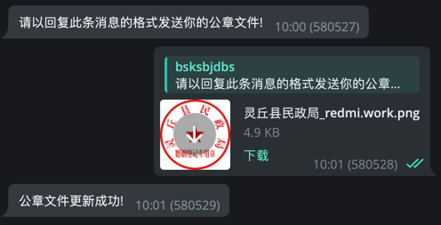

# ScriptWiz Docs

BOT: @ScriptWiz_bot

## 目录

- [对话模式](#对话模式)
  - [上传盖章文件](#1上传盖章文件)
- [命令模式](#命令模式)
  - [1.普通个户](#1普通个户-需携带照片)
  - [ 2.盖章](#2盖章-需携带照片)
  - [3.身份证正反面](#3身份证正反面-需携带照片)
  - [4.婚姻证书](#4婚姻证书-无需携带照片)
- [API](#api)
  - [URL](#url)
  - [所有参数解析](#所有参数解析)
  - [cURL 请求示例](#curl-请求示例)
  - [响应示例](#响应)
  - [注意事项](#注意事项)


# 对话模式
通过`回复消息`的方式向机器人传递参数, 对于新手比较友好 若不小心输入了错误信息可以`重新回复那条消息`, 这样会覆盖原来错误的参数

## 1.上传盖章文件
/start => [命令]更新婚姻公章文件 => 以回复消息的方式上传你的文件, 文件名后缀需要是 `png`


<br>

# 命令模式
以`参数+空格+照片`的形式来一次性传递参数, 效率比对话模式高, 但是没有容错, 如果有信息错误了只能重新输入

## 1.普通个户 (需携带照片)

> 男某某 352230198204010030 汉族 广西壮族自治区南宁市青秀区长湖路62号凤景湾住宅

## 2.盖章 (需携带照片)

> 男某某 352230198204010030 汉族 广西壮族自治区南宁市青秀区长湖路62号凤景湾住宅 北京大成（上海）律师事务所 艾可颂 13101201111267804 某某派出所

## 3.身份证正反面 (需携带照片)

> 男某某 352230198204010030 汉 广西壮族自治区南宁市青秀区长湖路62号凤景湾住宅 2020.07.07 2040.07.07 某某公安局

## 4.婚姻证书 (无需携带照片)

> 男某某 352230198204010030 女某某 352230198204010030 冀青结字123123123 某某县民政局 李四 2015-01-10 张三

<br>

# API

每次请求API需要将 `Authorization` 携带请求头中, 你可以在 /start => [功能]API => 申请APIKEY 中获得, 每个用户默认配额`1000次`, 不够用可以找客服加

## URL
| URL              | 说明       |
|:-----------------|:---------|
| 7C875DBD2174FF29 | 白底       |
| A2C5A59EDFCF2FB2 | 公网截图个户   |
| E22DD515CDBF5EF7 | PLC1     |
| DBEA98148B13F415 | PLC2     |
| A4F65A11FB9A18D3 | PLC3     |
| AAFD9F3AC069564D | 重庆电子身份凭证 |
| 9CD59B08B290F65A | 上海公安盖章   |
| 0A684E2931DE5DE7 | 身份证正反面1  |
| FCA96702E5BAF732 | 身份证正反面2  |
| AEB245E868CAB259 | 婚姻证书     |

## 所有参数解析
| 参数名            | 类型  | 说明             | 示例                  |
|:---------------|:----|:---------------|---------------------|
| output         | str | 回调类型           | `file`, `base64`    |
| name           | str | 姓名             | -                   |
| idcard         | str | 身份证            | -                   |
| nation         | str | 民族             | -                   |
| address        | str | 地址             | -                   |
| photo_base64   | str | 经base64编码的头像照片 | -                   |
| lawyer_name    | str | 律师姓名           | `艾可颂`               |
| lawyer_code    | str | 律师执业代码         | `13101201111267804` |
| lawyer_firm    | str | 律所姓名           | `北京大成（上海）律师事务所`     |
| address_police | str | 归属地派出所         | `北京市派出所`            |
| validity_start | str | 有效期开始时间        | `2000.01.01`        |
| validity_end   | str | 有效期到期时间        | `2020.01.01`        |
| organ          | str | 身份证签发机关        | `北京市公安局`            |
| man_name       | str | 男方姓名           | -                   |
| man_idcard     | str | 男方身份证          | -                   |
| girl_name      | str | 女方姓名           | -                   |
| girl_idcard    | str | 女方身份证          | -                   |
| owner_name     | str | 持证人姓名          | -                   |
| register_date  | str | 登记时间           | `2015-01-01`        |
| register_code  | str | 登记证字号          | -                   |
| register_organ | str | 登记机构           | `北京市民政局`            |
| register_name  | str | 登记员姓名          | -                   |

## cURL 请求示例

### 1. 白底个户

URL: 7C875DBD2174FF29
```bash
curl --location --request POST 'https://scriptwiz.787378.com/api/7C875DBD2174FF29?scene=api_service' \
--header 'Authorization: eyJhbG...' \
--header 'Content-Type: application/json' \
--data-raw '{
    "output": "file",
    "data": {
        "name": "吴昊",
        "idcard": "352230198204010030",
        "nation": "汉族",
        "address": "广西壮族自治区南宁市青秀区长湖路62号凤景湾住宅小区",
        "photo_base64": "/9j/4A..."

    }
}'
```

### 2. 盖章

URL: 9CD59B08B290F65A
```bash
curl --location --request POST 'https://scriptwiz.787378.com/api/9CD59B08B290F65A?scene=api_service' \
--header 'Authorization: eyJhbG...' \
--header 'Content-Type: application/json' \
--data-raw '{
    "output": "file",
    "data": {
        "name": "吴昊",
        "idcard": "352230198204010030",
        "nation": "汉族",
        "address": "广西壮族自治区南宁市青秀区长湖路62号凤景湾住宅小区",
        "photo_base64": "/9j/4A...",
        "lawyer_name": "艾可颂",
        "lawyer_code": "13101201111267804",
        "lawyer_firm": "北京大成（上海）律师事务所",
        "address_police": "北京市派出所"
    }
}'
```

### 3. 身份证正反面

URL: 0A684E2931DE5DE7
```bash
curl --location --request POST 'https://scriptwiz.787378.com/api/0A684E2931DE5DE7?scene=api_service' \
--header 'Authorization: eyJhbG...' \
--header 'Content-Type: application/json' \
--data-raw '{
    "output": "file",
    "data": {
        "name": "吴昊",
        "idcard": "352230198204010030",
        "nation": "汉族",
        "address": "广西壮族自治区南宁市青秀区长湖路62号凤景湾住宅小区",
        "photo_base64": "/9j/4A...",
        "validity_start": "2000.01.01",
        "validity_end": "2020.01.01",
        "organ": "北京市公安局"
    }
}'
```

<br>

## 响应
| 参数名     | 类型   | 说明                                               |
|:--------|:-----|:-------------------------------------------------|
| ok      | bool | 是否成功                                             |
| message | str  | 接口提示                                             |
| data    | str  | 当output为`file`时, 返回文件URL, 为`base64`时返回 base64 数据 |

### 成功响应

```
{
  "ok": true,
  "message": "",
  "data": "https://scriptwiz.787378.com/download/1527F751*****.png?scene=api_service"
}
```

### 失败响应

```
{
  "ok": false,
  "message": "organ, parameter is missing",
  "data": ""
}
```

## 注意事项

注意: 如果API请求跳出CF的拦截页面, 请检查你的URL中是否包含`scene=api_service`, 若包含了还跳出请检查你输入的信息是否完全正确, 例如身份证, 地址等...